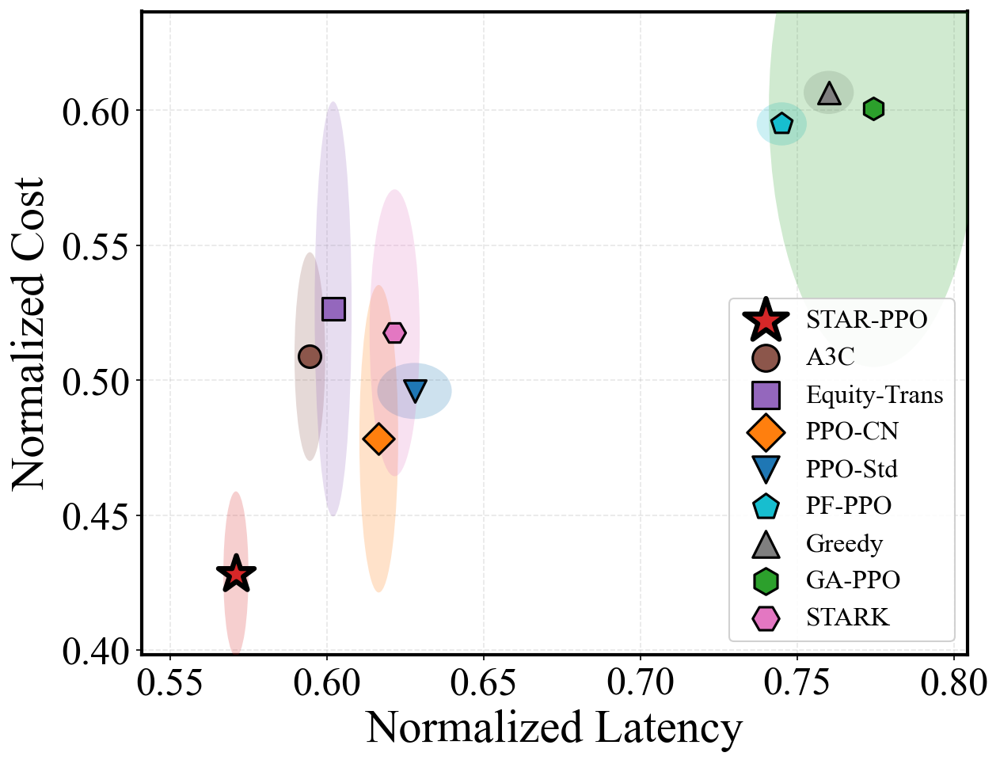

<div align="center">

# STEM: Workflow-Aware Expert Routing for Distributed LLM Serving

Official implementation of the paper  
**"Workflow-Aware Expert Routing for Distributed LLM Serving over the Edge-Cloud Continuum"**

[](https://www.python.org/)
[](https://pytorch.org/)
[](#overview)

</div>

## Overview

STEM is a service-level, topology-aware orchestration framework for distributed LLM serving over the edge-cloud continuum. It represents heterogeneous LLM service instances as specialized experts and routes the dependent steps of a DAG workflow across these instances while considering latency, monetary cost, and service reliability.

The decision engine of STEM is **STAR-PPO**, a spatio-temporal augmented reinforcement-learning scheduler. STAR-PPO uses a lightweight graph-free perception mechanism to extract topology and resource bottlenecks from service telemetry, avoiding full message passing over large infrastructure graphs. A **Dynamic Weight Adaptation (DWA)** controller adjusts the optimization preferences during training to prevent the policy from collapsing onto a single objective.

The repository contains the proposed method, nine comparison methods, datasets and workload configurations, ablation and generalization experiments, supplementary evaluations, and scripts used to generate the paper figures.

## Main Features

- **Workflow-aware routing:** schedules dependent LLM-service steps instead of treating requests as independent single-hop calls.
- **Topology-aware perception:** incorporates node load, link quality, predecessor location, and workflow context without a GNN message-passing stage.
- **Adaptive multi-objective control:** balances latency, cost, and risk through DWA-guided PPO training.
- **Large-scale evaluation:** supports service-overlay configurations with 500, 1,000, and 2,000 nodes, including adversarial network-trap settings.
- **Reproducibility suite:** includes baseline implementations, saved plotting data, ablation studies, distribution-shift tests, and supplementary experiments.

## Repository Structure

```text
.
|-- TopoFreeRL/                    # STAR-PPO implementation (proposed method)
|   |-- agent.py                   # PPO agent and optimization logic
|   |-- model.py                   # Preference-aware actor and critic
|   |-- env_augmented.py           # Spatio-temporal augmented environment
|   |-- train.py                   # Training entry point
|   `-- inference.py               # Checkpoint evaluation
|-- A3C_algorithm/                 # A3C baseline
|-- PFAPPO/                        # PF-PPO baseline
|-- PPO_algorithm/                 # Standard PPO baseline
|-- PPO_CN/                        # Colored-noise PPO baseline
|-- PPO_GNN/                       # Graph-augmented PPO baseline
|-- Stark_Scheduler/               # STARK baseline
|-- Trans/                         # Transformer-based baseline
|-- Greedy/                        # Greedy scheduler
|-- Random/                        # Random scheduler
|-- data1/                         # Service nodes, links, workflows, and traces
|-- inference/                     # Multi-method evaluation entry points
|-- results_figures/               # Main-paper plotting scripts and figures
|-- data_for_plot/                 # Saved source data for figure reproduction
|-- Ablation Studies/              # STAR-PPO component ablations
|-- Generalization Experiments/    # DAG, workload, and scale generalization
|-- Supplementary experiments/     # Additional evaluations E01--E10
|-- env.py                         # Shared workflow-routing environment
|-- metrics.py                     # Latency, cost, SLA, risk, and QoS metrics
|-- utils.py                       # Shared utilities
`-- FIGURES_GUIDE.md               # Detailed figure-to-script mapping
```

The proposed-method package is named `TopoFreeRL` internally for compatibility with the experiment scripts; the method reported in the paper is **STAR-PPO**, and the complete orchestration framework is **STEM**.

## Environment Setup

Create an isolated Python environment and install the core dependencies:

```bash
conda create -n stem python=3.12 -y
conda activate stem

pip install numpy pandas matplotlib torch
```

The GA-PPO baseline additionally requires PyTorch Geometric. Install the build matching your PyTorch and CUDA versions by following the [official PyG instructions](https://pytorch-geometric.readthedocs.io/en/latest/install/installation.html).

CUDA is optional for inference but recommended for training. All commands below should be executed from the repository root.

## Dataset Layout

The experiments use three service-overlay scales and their corresponding network-trap variants:

| Configuration | Service nodes | Geographic setting | Purpose |
|---|---:|---|---|
| `Server1` / `Server1_Trap` | 500 | Switzerland | Main evaluation and adversarial-link test |
| `Server2` / `Server2_Trap` | 1,000 | United Kingdom | Medium-scale evaluation |
| `Server3` / `Server3_Trap` | 2,000 | Germany | Large-scale and transfer evaluation |

Each configuration is stored under `data1/<configuration>/` and contains:

```text
servers.csv
network_links.csv
model_instances.csv
tasks.csv
task_request_mapping.csv
request_log.csv
session_stats.csv
trap_config.json              # Present in trap configurations
```

The topology configurations are derived from OpenCelliD geospatial records, while the workload files describe DAG-based LLM-service workflows and request-level execution information. Large trace files may be distributed separately from the Git repository; after downloading them, preserve the directory structure shown above.

## Quick Start

### 1. Train STAR-PPO

The following command trains STAR-PPO on the main `Server1_Trap` configuration:

```bash
python TopoFreeRL/train.py \
  --data data1 \
  --regions Server1_Trap \
  --epochs 100 \
  --episodes 200 \
  --device cuda \
  --seed 42
```

Checkpoints and training records are written under:

```text
results/TopoFreeRL/models/
results/TopoFreeRL/logs/
```

Use `--device cpu` when CUDA is unavailable.

### 2. Evaluate a Checkpoint

```bash
python TopoFreeRL/inference.py \
  --data data1 \
  --region Server1_Trap \
  --split test \
  --model results/TopoFreeRL/models/<checkpoint>.pt \
  --episodes 200 \
  --device cuda
```

Detailed request-level results are saved in `inference/results/` as compressed NumPy files.

### 3. Train Comparison Methods

Each learned baseline provides its own `train.py`, `inference.py`, and, where applicable, `run_batch.py`. Run the relevant script with `--help` before training because the available command-line options differ slightly across baseline implementations. The main experiments use the same dataset split and evaluation protocol for all learned methods.

## Reproducing the Paper Figures

Preprocessed plotting data are provided in `data_for_plot/`. The principal figures can be regenerated without retraining every method:

```bash
# Reward, latency, and cost learning curves
python results_figures/plot_all_comparison.py

# Latency--cost trade-off and latency CDF
python results_figures/plot_pareto.py --server1
python results_figures/plot_cdf.py --server1

# Cost decomposition and scalability
python results_figures/plot_cost_breakdown.py --server1
python results_figures/plot_scalability.py

# Consolidated performance table
python results_figures/generate_giant_table.py
```

For ablation, generalization, and supplementary figures, see [`FIGURES_GUIDE.md`](FIGURES_GUIDE.md), which maps every figure to its source data, generating script, and output file.

## Main Results

On the 500-node `Server1_Trap` setting, STAR-PPO achieves the best overall latency--cost--reliability trade-off among the evaluated methods. The paper reports an average latency of **2112.22 ms**, a P99 latency of **4558.04 ms**, and a Composite QoS Score of **65.93**. Relative to the greedy scheduler, STAR-PPO reduces average latency by **24.4%** and network cost by **96.8%**.



The repository also includes evaluations of workflow length, injected network disturbances, cross-region zero-shot transfer, unseen traffic patterns, component ablations, and decision-time scalability from 500 to 2,000 service nodes.

## Reproducibility Notes

- Set `--seed` explicitly for repeatable training runs.
- Run commands from the repository root so that shared modules and relative data paths resolve correctly.
- Training outputs are not required for plotting when the corresponding source arrays are already present in `data_for_plot/`.
- Some evaluation scripts contain experiment-specific checkpoint mappings. Replace these paths with locally trained checkpoints when rerunning full multi-method evaluations.
- The simulation evaluates service-level expert routing; it does not execute the underlying LLM weights or perform token-level MoE routing.

## Citation

If this repository is useful in your research, please cite the associated paper. The final BibTeX entry will be added after publication.

```text
Workflow-Aware Expert Routing for Distributed LLM Serving over the Edge-Cloud Continuum
```

## Contact

For questions about the code, datasets, or experimental protocol, please contact:

**Yan Gao**  
Tianjin University  
Email: [gymorsiback@tju.edu.cn](mailto:gymorsiback@tju.edu.cn)
